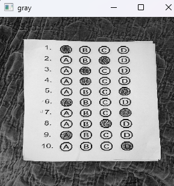

# Computer Vision (and Image Processing) Quiz Grader
A simple multiple choice grader using OpenCV for Python, completed as practice 
for a class on graphics programming.

---

## Credit
The bulk of the code for this project can be attributed to [**this tutorial**](https://pyimagesearch.com/2016/10/03/bubble-sheet-multiple-choice-scanner-and-test-grader-using-omr-python-and-opencv/) by Adrian Rosebrock.

---

## Introduction
As mentioned above, this script was created for practice as a beginner in 
graphics programming. The goal of this script is to process an image of a 
multiple choice quiz and determine a grade based on filled in bubbles with a 
user-provided answer key.  

#

Currently, there are a few problems that I anticipate fixing at some point:

1. Low contrast, high-texture backgrounds trip up the Canny edge detector. 
   I've tried to remedy with various preprocessing setups,
   but I suspect that I will need to learn more about adaptive thresholding 
   and/or advanced filtering algorithms.
   
2. There is no handle for instances where a question is left blank.
   In this case, it's up to the script to "randomly" pick an answer
   for you, determined by the count of non-zero pixels in a given bubble.
   
3. While the script properly grades the papers visually, it spits out 
   percentages that aren't entirely accurate. For example, I have
   a 7/10 score based on the image output from the script. It should be
  instantly obvious that the grade is 70%, yet I've been getting
   values of 77.78%. It might be some incredibly small and obvious math error 
   that I've overlooked.

* *Also note*: Using our previous logic, if a given quesiton has multiple bubbled
answers, the script will determine that the darkest colored bubble is the 
provided answer.

---

## Concept / Pipeline 
This script can be broken down and grouped into a few simple steps:

### 1. Edge / Contour Detection

#### &ensp; Flowchart
&emsp; 

#### &ensp; Description
1. As you can see above, this step is composed of three smaller steps,
image preprocessing, Canny edge detection, and quiz contour detection.

2. The image preprocessing consists of conversion to grayscale, median blur, 
bilateral filtering.

#### &ensp;Example

##### &emsp; Provided Answer Key
&emsp; 

##### &emsp; Original Image
&emsp; 

##### &emsp; Convert to Grayscale
&emsp; 

##### &emsp; Canny Edge Detect 
&emsp; 

##### &emsp; Find Contours
&emsp; 

#

### 2. Transformations / Morphing

#### &ensp; Flowchart
&emsp; 

#### &ensp; Description
1. As you can see above, this step is composed of two smaller steps.
The first step is a perspective transform, which will yield a new image focused
on the quiz. In simple terms, the perspective transform/warp uses the contours 
from the previous step to match the edges of the image/window to the edges of
the document/quiz.

2. The second step is an image binarization using Otsu's method,
which thresholds/normalizes the quiz.

#### &ensp; Example

##### &emsp; Warp Image
&emsp; 

##### &emsp; Binarize Image
&emsp; 

#

### 3. "Bubble" Detection

#### &ensp; Flowchart
&emsp; 

#### &ensp; Description
1. As you can see above, this step was not composed of any notable sub-steps.
However, the algorithm is worth investigating in more detail. 

2. To detect bubbles (or options/answers) on the quiz, we'll scan the binarized 
document for contours using the external contour retrieval mode, thereby 
ignoring the inner contours for filled in bubbles. 

3. The next step is to filter out any non-bubble contours that may have been 
detected. That is done by checking each contour's bounding rectangle, passing it
through a minimum threshold for height and width, and enforcing an approximate 
1.0 aspect ratio (the expected aspect ratio for a standard circle/bubble). 

4. Though it hasn't been tested yet, this should/may also allow for boxed or
square-shaped answers.

#### &ensp; Example

##### &emsp; Bubble Contours
&emsp; 

#

### 4. Grading

#### &ensp; Flowcharts
&emsp;  
&emsp; The logic for the loop/iteration:
&emsp; 

#### &ensp; Description
1. As it appears, there are a few sub-steps to this step. However, at further
investigation, most of these steps are rather simple. Instead of breaking down
the chart, let's delve deeper in to the logic of the algorithm as a whole.

2. First, we group bubble contours by row. Then, we sort the row in order from
left to right. 

3. Next, we detect a provided answer by iterating through each bubble contour, 
masking it, and counting the number of non-zero pixels. If the count is greater 
than any of the previous bubbles for that row, that bubble becomes the new 
answer. Think of it as *similar* to bubble sort.

4. After determining the answer for a row, we compare its index with the 
expected answer in the provided answer key. We then draw a red contour for 
incorrect answers, and a blue contour for correct answers. Correct answers are 
added to the score tally, which is then calculated as a final grade percent and 
rounded to two decimal places. 

5. Finally, the grade is returned in console output and printed on a final image 
of the quiz.

#### &ensp; Example

##### &emsp; Iterating Through Bubble Masks
&emsp;  
&emsp; *In this instance, the "A" bubble would be recognized as the mask with 
the most non-zero pixels*
 
##### &emsp; Graded Quiz Image / Output
&emsp; 

---

## Usage
*To-do*